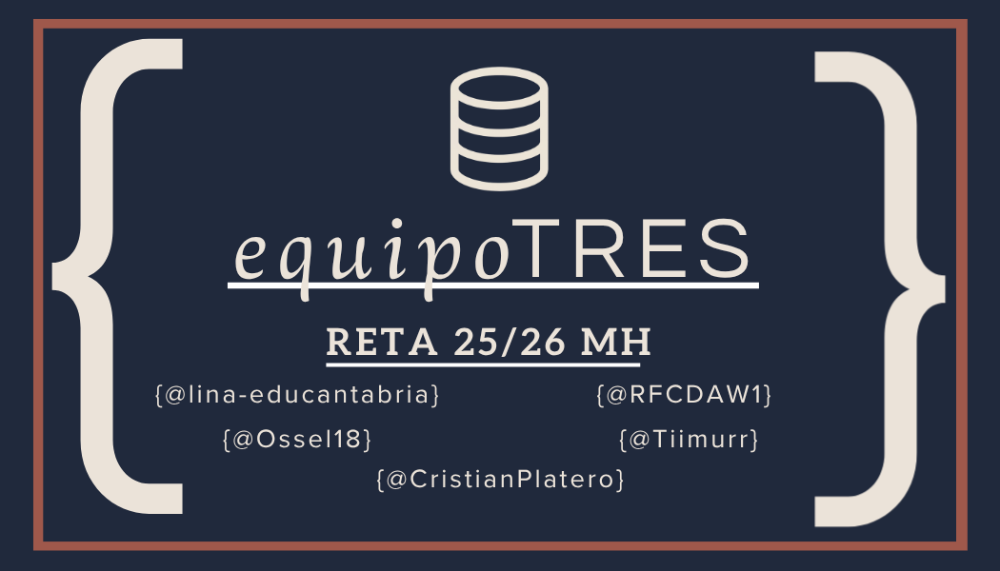
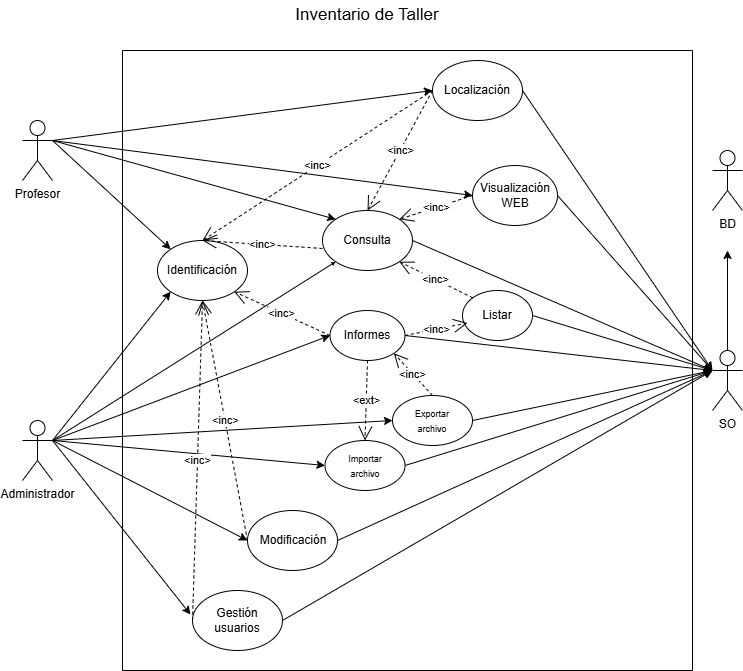

# 🚀 HISTORIAS DEL HARDWARE - RETA CANTABRIA 2526
[](https://github.com/CristianPlatero/RETA_2526---Equipo3)
[](docs/Metodologia.md)
[](https://www.gnu.org/licenses/gpl-3.0.html)
[](https://github.com/CristianPlatero/RETA_2526---Equipo3/releases)
[](CONTRIBUTING.md)


> 
> 


---
## PROYECTO DE GESTIÓN Y LOCALIZACIÓN DEl MATERIAL DEL TALLER DE INFORMÁTICA
## 🗂️ Índice

1. [📖 Descripción](#-descripción)
   - [🏗️ Arquitectura del sistema](#️-arquitectura-del-sistema)
   - [🌟 ¿Por qué este proyecto?](#-por-qué-este-proyecto)
   - [🔁 Metodología de trabajo](#-metodología-de-trabajo)
   - [✨ Características principales](#-características-principales)
2. [⚙️ Instalación](#️-instalación)
3. [🛠️ Uso](#️-uso)
4. [🌳 Estructura del proyecto](#-estructura-del-proyecto)
5. [🗺️ Roadmap](#️-roadmap)
6. [🆘 Soporte](#-soporte)
7. [👥 Autores y agradecimientos](#-autores-y-agradecimientos)
8. [📄 Licencia](#-licencia)
9. [📚 Referencias](#-referencias)
10. [📊 Estado del proyecto](#-estado-del-proyecto)


---

## 📖 Descripción

Este proyecto es la **culminación del primer curso del C.F.G.S. de Desarrollo de Aplicaciones Web**. El **Equipo 3** ha diseñado y construido una base de datos y su correspondiente aplicación en Java para la **gestión y localización del material electrónico** del Taller de Informática.

Está dirigida al **profesorado** del taller, con una interfaz sencilla y funcional que ofrece en todo momento la información que necesitan:

- 📍 Ubicación de cada componente
- 📦 Control de stock en tiempo real
- 📊 Informes exportables a PDF y Excel
- 🗺️ Plano interactivo de la distribución física del taller

---

### 🏗️ Arquitectura del sistema

**🖥️ Aplicación de escritorio Java**
Interfaz construida con **Java Swing**, conectada a la base de datos mediante **JDBC**. Incluye tres módulos:
- 🔐 **Módulo de inventario** — gestión completa (Administrador)
- 🔍 **Módulo de consulta** — localización de componentes (Profesor)
- 📄 **Módulo de informes** — exportación a PDF / Excel

**🌐 Página web del taller**
Muestra de forma gráfica la **distribución física del taller**, accesible desde los ordenadores del laboratorio. Desarrollada con `HTML`, `CSS` y `JavaScript`.

**🛠️ Infraestructura virtualizada**
El sistema se despliega sobre dos máquinas virtuales con separación de responsabilidades:
- **MV 1** — Aloja la base de datos MySQL. Solo accesible desde la MV 2.
- **MV 2** — Aloja la aplicación web. Accesible desde los equipos del laboratorio.

> **Stack tecnológico:** `Java` · `MySQL` · `JDBC` · `Java Swing` · `HTML/CSS/JS`

---

### 🌟 ¿Por qué este proyecto?

Más allá del producto final, este proyecto tiene un objetivo clave: **demostrar que somos capaces de trabajar como un equipo de desarrolladores real**. El proceso, la metodología y la colaboración son tan importantes como el software entregado.

> 💡 El verdadero producto final no es solo la aplicación — somos nosotros como equipo, y la forma en que hemos aprendido a trabajar juntos.

### 🔁 Metodología de trabajo

Trabajamos siguiendo el marco ágil **SCRUM** e incorporamos **Pair Programming** como técnica diferenciadora: dos programadores comparten un mismo equipo, lo que fomenta la revisión continua del código, reduce errores y acelera el aprendizaje colectivo.

### ✨ Características principales

- **Interfaz dinámica** — navegación fluida entre módulos adaptada al perfil del usuario (Administrador / Profesor).
- **Base de datos completa** — modelo relacional normalizado con disparadores para mantener la integridad del inventario.
- **Aplicación de escritorio ligera y robusta** — ejecutable `.jar` sin dependencias externas al JRE, con gestión de errores y validación de formularios.
- **Página web interactiva** — plano visual del taller con localización en tiempo real de los componentes.
- **Diseño elegante y _user friendly_** — interfaz limpia e intuitiva, pensada para usuarios no técnicos.

---

## ⚙️ Instalación

### Requisitos previos

Antes de instalar, asegúrate de tener lo siguiente:

- [Java JRE](https://www.java.com/) >= 17
- [Git](https://git-scm.com/)
- [VirtualBox](https://www.virtualbox.org/) (para desplegar las máquinas virtuales)

### Instalación paso a paso

**1. Clona el repositorio**

```bash
git clone https://github.com/CristianPlatero/RETA_2526---Equipo3.git
cd RETA_2526---Equipo3
```

**2. Importa las máquinas virtuales**

Descarga los archivos `.ova` desde los enlaces indicados en el repositorio e impórtalos en VirtualBox:

- **MV1** — Servidor de base de datos MySQL
- **MV2** — Servidor web con el sitio del taller

**3. Ejecuta la aplicación de escritorio**

```bash
java -jar App.jar
```

> 📚 Para instrucciones detalladas de despliegue, consulta la [Guía de despliegue](docs/guia-despliegue.pdf).

---

## 🛠️ Uso

Una vez en marcha, la aplicación presenta dos perfiles de acceso:

- **Administrador** — acceso completo al módulo de inventario: altas, bajas, modificaciones y generación de informes.
- **Profesor** — acceso al módulo de consulta para localizar componentes y visualizar el plano del taller.

> 📚 Para una guía completa por perfil, consulta el [Manual de usuario](docs/manual-usuario.pdf).

---
## 📊 Diagramas del Proyecto

A continuación se presentan los diagramas que describen la estructura y el comportamiento del sistema.

---

### 1. Diagrama de Casos de Uso 

**¿Qué es?**  
Un diagrama de casos de Uso describe las interacciones entre los usuarios (actores) y el sistema. Ayuda a definir el alcance del proyecto y a entender qué acciones puede realizar cada tipo de usuario de una manera visual y sencilla.



---

### 2. Diagrama de Clases

**¿Qué es?**  
Un diagrama de clases es un modelo estructural que muestra las clases del sistema, sus atributos, sus métodos y cómo se relacionan entre sí (por ejemplo, por herencia o asociación). Es la pieza fundamental para entender la arquitectura y el diseño orientado a objetos del código.


---

## 🌳 Estructura del proyecto

> Capturas del árbol de carpetas del repositorio.

```
├── 📂 docs
│   ├── 📂 assets
│   │   ├── 📂 img
│   │   └── 📂 taller_fotos
│   ├── 📂 DiagramaCasoUsos
│   │   ├── 📄 DiagramaCasoUso_01.png
│   │   └── 📄 DiagramaCasoUsos_01.drawio
│   ├── 📄 informe_revision_BBDD.md
│   ├── 📄 Licencias.md
│   ├── 📄 Licencias.pdf
│   ├── 📄 Metodologia.md
│   └── 📄 presentacion_reto_inventario.pptx
├── 📄 LICENSE.md
└── 📄 README.md

<<En desarrollo>>
```

---

## 🗺️ Roadmap

- [x] Repositorio GitHub público: Wiki con páginas «Contrato de equipo» y «Roles»; Issues con el cuaderno de 
      trabajo diario (etiqueta cuaderno-trabajo); tablero GitHub Projects con asignación y seguimiento de tareas; 
      commits y push diarios. 
- [x] Cuaderno de trabajo diario del equipo en GitHub Issues: un Issue por jornada usando la plantilla «Cuaderno 
      de trabajo» (etiqueta cuaderno-trabajo), asignado a todos los miembros del equipo y creado el mismo día 
      de la jornada. 
- [x] Documentación del reto en Markdown en el repositorio GitHub (README): índice, descripción, miembros, 
      resultados, tecnologías, valoración y webgrafía. 
- [x] Diagrama E/R y diagrama relacional de la base de datos (en repositorio y documentación). 
- [x] Script SQL de creación de la base de datos con datos ficticios de prueba, en repositorio GitHub. 
- [ ] Script con disparadores de la base de datos, en repositorio GitHub. 
- [ ] Diagrama de clases completo (en repositorio y documentación). 
- [x] Diagrama de casos de uso (en repositorio y documentación). 
- [x] Código fuente de la aplicación de escritorio Java en repositorio GitHub, documentado con JavaDoc. 
- [x] Ejecutable de la aplicación de escritorio Java (.jar). 
- [x] Código HTML, CSS y JavaScript del sitio web en repositorio GitHub. 
- [ ] (Opcional) Código de las hojas de estilos XSLT en repositorio GitHub. 
- [ ] Guía de despliegue de la aplicación en PDF: documentación del despliegue de MV1 y MV2 en VirtualBox, 
      diagrama de arquitectura de red, comparativa de tecnologías, configuración ufw, conexión SSH, 
      transferencia SFTP y webgrafía. Enlazada al repositorio GitHub. 
- [x] MV1 exportada en formato .ova con el servidor de base de datos montado, configurado y con la BD 
      cargada. Subida al canal de Teams con enlace de descarga en el repositorio GitHub. 
- [x] MV2 exportada en formato .ova con el servidor web, SFTP y SSH montados, configurados y con el sitio 
      web desplegado. Subida al canal de Teams con enlace de descarga en el repositorio GitHub. 
- [ ] Manual de usuario de la aplicación de escritorio en PDF: requerimientos HW/SW, licencia justificada con 
   comparación de ≥ 3 licencias y archivo LICENSE en GitHub, guía de uso por perfil y webgrafía. Enlazado 
   al repositorio GitHub. 
- [x] Tareas entregadas por Teams para el módulo de IPEI. 
- [ ] Presentación del proyecto final del equipo (con enlace desde el repositorio GitHub).

¿Tienes ideas? Abre un [issue](https://github.com/CristianPlatero/RETA_2526---Equipo3/issues) con la etiqueta `mejoras`.

---

## 🆘 Soporte

Si tienes problemas o preguntas:

- 🐛 **Bugs y problemas**: abre un [issue](https://github.com/CristianPlatero/RETA_2526---Equipo3/issues)
- 💬 **Preguntas y discusión**: únete a nuestro [GitHub Discussions](https://github.com/CristianPlatero/RETA_2526---Equipo3/discussions)
- 📧 **Contacto directo**: [CristianPlatero](mailto:cplateroz2501@educantabria.es)

---

## 👥 Autores y agradecimientos

**Autores**

- [@lina-educantabria](https://github.com/lina-educantabria) — Diseño y desarrollo
- [@Ossel18](https://github.com/Ossel18) — Diseño y desarrollo
- [@RFCDAW1](https://github.com/RFCDAW1) — Diseño y desarrollo
- [@tiimurr](https://github.com/tiimurr) — Diseño y desarrollo
- [@CristianPlatero](https://github.com/CristianPlatero) — Diseño y desarrollo

Un agradecimiento especial a los profesores de DAW1 y los compañeros de los demás equipos por su ayuda, servir de inspiración, y a todos los que han abierto issues y PRs.

---

## 📄 Licencia

Este proyecto está licenciado bajo Licencia **[GPLv3](https://www.gnu.org/licenses/gplv3-the-program.es.html#mission-statement)**. Consulta el archivo [LICENSE](LICENSE.md) para más detalles.

---

## 📚 Referencias

> Estos son los recurso que el equipo ha utilizado para la creación del proyecto:

| # | Recurso | URL |
|---|---------|-----|
| 1 | Plantillas README| [Best README Template](https://github.com/othneildrew/Best-README-Template?tab=readme-ov-file) |
| 2 | Badges| [Shields.io](https://shields.io/badges)|
| 3 | | |

---

## 📊 Estado del proyecto

> ✅ **En desarrollo activo** — Se aceptan contribuciones e issues.


<!-- Si el proyecto está pausado, usa algo como: -->
<!-- ⚠️ **Mantenimiento mínimo** — Este proyecto recibe únicamente correcciones críticas. Si quieres tomar el relevo como mantenedor, abre un issue. -->
<!-- ❌ **Archivado** — Este proyecto ya no recibe mantenimiento activo. -->
