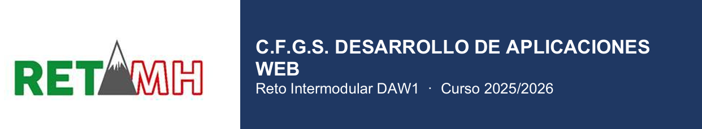
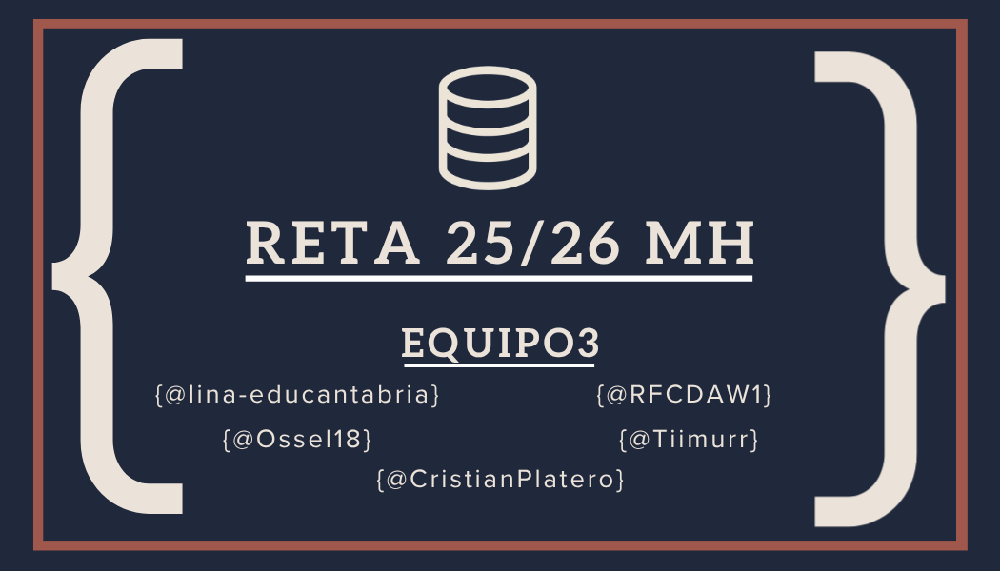

# 🚀 HISTORIAS DEL HARDWARE - RETA CANTABRIA 2526
[](https://github.com/CristianPlatero/RETA_2526---Equipo3)
[](docs/Metodologia.md)
[](https://www.gnu.org/licenses/gpl-3.0.html)
[](https://github.com/CristianPlatero/RETA_2526---Equipo3/releases)
[](CONTRIBUTING.md)


> 
> 


---
#Gestión y Localización del Material del Taller de Informática
## 🗂️ Índice

1. [📖 Descripción](#-descripción)
   - [🏗️ Arquitectura del sistema](#️-arquitectura-del-sistema)
   - [🌟 ¿Por qué este proyecto?](#-por-qué-este-proyecto)
   - [🔁 Metodología de trabajo](#-metodología-de-trabajo)
   - [✨ Características principales](#-características-principales)
   - [🖼️ Capturas de pantalla / Demo](#️-capturas-de-pantalla--demo)
2. [⚙️ Instalación](#️-instalación)
3. [🛠️ Uso](#️-uso)
4. [🗺️ Roadmap](#️-roadmap)
5. [🆘 Soporte](#-soporte)
6. [👥 Autores y agradecimientos](#-autores-y-agradecimientos)
7. [📄 Licencia](#-licencia)
8. [📊 Estado del proyecto](#-estado-del-proyecto)


---

## 📖 Descripción

Este proyecto es la **culminación del primer curso del C.F.G.S. de Desarrollo de Aplicaciones Web**. El **Equipo 3** ha diseñado y construido una base de datos y su correspondiente aplicación en Java para la **gestión y localización del material electrónico** del Taller de Informática.

Está dirigida al **profesorado** del taller, con una interfaz sencilla y funcional que ofrece en todo momento la información que necesitan:

- 📍 Ubicación de cada componente
- 📦 Control de stock en tiempo real
- 📊 Informes exportables a PDF y Excel
- 🗺️ Plano interactivo de la distribución física del taller

---

### 🏗️ Arquitectura del sistema

**🖥️ Aplicación de escritorio Java**
Interfaz construida con **Java Swing**, conectada a la base de datos mediante **JDBC**. Incluye tres módulos:
- 🔐 **Módulo de inventario** — gestión completa (Administrador)
- 🔍 **Módulo de consulta** — localización de componentes (Profesor)
- 📄 **Módulo de informes** — exportación a PDF / Excel

**🌐 Página web del taller**
Muestra de forma gráfica la **distribución física del taller**, accesible desde los ordenadores del laboratorio. Desarrollada con `HTML`, `CSS` y `JavaScript`.

**🛠️ Infraestructura virtualizada**
El sistema se despliega sobre dos máquinas virtuales con separación de responsabilidades:
- **MV 1** — Aloja la base de datos MySQL. Solo accesible desde la MV 2.
- **MV 2** — Aloja la aplicación web. Accesible desde los equipos del laboratorio.

> **Stack tecnológico:** `Java` · `MySQL` · `JDBC` · `Java Swing` · `HTML/CSS/JS`

---

### 🌟 ¿Por qué este proyecto?

Más allá del producto final, este proyecto tiene un objetivo clave: **demostrar que somos capaces de trabajar como un equipo de desarrolladores real**. El proceso, la metodología y la colaboración son tan importantes como el software entregado.

> 💡 El verdadero producto final no es solo la aplicación — somos nosotros como equipo, y la forma en que hemos aprendido a trabajar juntos.

### 🔁 Metodología de trabajo

Trabajamos siguiendo el marco ágil **SCRUM** e incorporamos **Pair Programming** como técnica diferenciadora: dos programadores comparten un mismo equipo, lo que fomenta la revisión continua del código, reduce errores y acelera el aprendizaje colectivo.

### ✨ Características principales

- **Interfaz dinámica** — descripción concisa de lo que aporta.
- **Base de datos completa** — descripción concisa de lo que aporta.
- **Aplicación de escritorio ligera y robusta** — descripción concisa de lo que aporta.
- **Página web interactiva** — descripción concisa de lo que aporta.
- **Diseño elegante y 'user friendly'** — descripción concisa de lo que aporta.

### 🖼️ Capturas de pantalla / Demo

> Incluye aquí screenshots, GIFs animados o un enlace a una demo en vivo. Una imagen vale más que mil palabras.

```
<!-- Ejemplo -->

```

[](https://RETA_2526---Equipo3/releases.example.com)

---

## ⚙️ Instalación

### Requisitos previos

Antes de instalar, asegúrate de tener lo siguiente:

- [Node.js](https://nodejs.org/) >= 18.0 (o el runtime que aplique)
- [Git](https://git-scm.com/)
- Cualquier otra dependencia del sistema

### Instalación paso a paso

**1. Clona el repositorio**

```bash
git clone https://github.com/CristianPlatero/RETA_2526---Equipo3/releases.git
cd tuproyecto
```

**2. Instala las dependencias**

```bash
npm install
# o con yarn
yarn install
```

**3. Configura las variables de entorno**

```bash
cp .env.example .env
# Edita .env con tus valores
```

**4. Inicia el proyecto**

```bash
npm run dev
```

La aplicación estará disponible en `http://localhost:3000`.

---

## 🛠️ Uso

El ejemplo más pequeño posible para demostrar el valor del proyecto:

```bash
# Ejemplo básico
RETA_2526---Equipo3 --input archivo.txt --output resultado.json
```

**Salida esperada:**

```
✔ Procesado: archivo.txt
✔ Resultado guardado en: resultado.json
```

### Ejemplos adicionales

```bash
# Modo verbose
RETA_2526---Equipo3 --input archivo.txt --verbose

# Procesamiento por lotes
RETA_2526---Equipo3 --batch ./carpeta/ --format json
```

> 📚 Para ejemplos más avanzados y casos de uso completos, consulta la [documentación oficial](https://github.com/CristianPlatero/RETA_2526---Equipo3/docs).

---


### Configuración del entorno de desarrollo

```bash
# Instalar dependencias de desarrollo
npm install

# Ejecutar tests
npm test

# Lint
npm run lint

# Build de producción
npm run build
```


---

## 🗺️ Roadmap

- [x] Funcionalidad base
- [x] Creación e instalación de BBDD relacional
- [ ] Compilación de programa Java
- [ ] Diseño de GUI
- [ ] Funcionalidades extra
- 

¿Tienes ideas? Abre un [issue](https://github.com/CristianPlatero/RETA_2526---Equipo3/issues) con la etiqueta `mejoras`.

---

## 🆘 Soporte

Si tienes problemas o preguntas:

- 🐛 **Bugs y problemas**: abre un [issue](https://github.com/CristianPlatero/RETA_2526---Equipo3/issues)
- 💬 **Preguntas y discusión**: únete a nuestro [GitHub Discussions](https://github.com/CristianPlatero/RETA_2526---Equipo3/discussions)
- 📧 **Contacto directo**: [CristianPlatero](mailto:cplateroz2501@educantabria.es)

---

## 👥 Autores y agradecimientos

**Autores**

- [@lina-educantabria](https://github.com/lina-educantabria) — Diseño y desarrollo
- [@Ossel18](https://github.com/Ossel18) — Diseño y desarrollo
- [@RFCDAW1](https://github.com/RFCDAW1) — Diseño y desarrollo
- [@tiimurr](https://github.com/tiimurr) — Diseño y desarrollo
- [@CristianPlatero](https://github.com/CristianPlatero) — Diseño y desarrollo

Un agradecimiento especial a los profesores de DAW1 y los compañeros de los demás equipos por su ayuda, servir de inspiración, y a todos los que han abierto issues y PRs.

---

## 📄 Licencia

Este proyecto está licenciado bajo Licencia **[GPLv3](https://www.gnu.org/licenses/gplv3-the-program.es.html#mission-statement)**. Consulta el archivo [LICENSE](LICENSE.md) para más detalles.

---

## 📊 Estado del proyecto

> ✅ **En desarrollo activo** — Se aceptan contribuciones e issues.

<!-- Si el proyecto está pausado, usa algo como: -->
<!-- ⚠️ **Mantenimiento mínimo** — Este proyecto recibe únicamente correcciones críticas. Si quieres tomar el relevo como mantenedor, abre un issue. -->
<!-- ❌ **Archivado** — Este proyecto ya no recibe mantenimiento activo. -->
